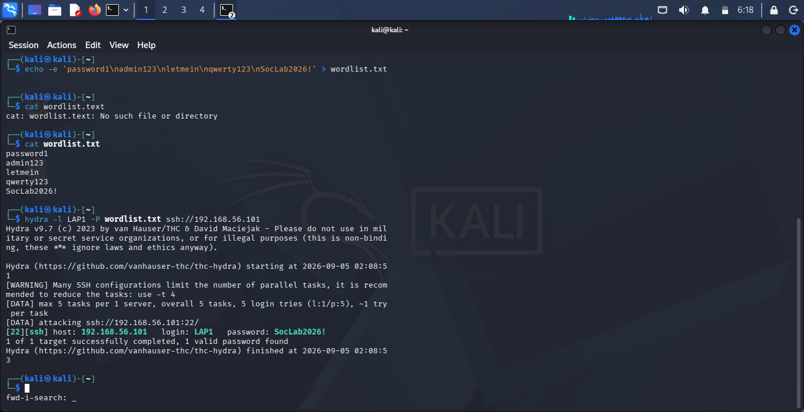
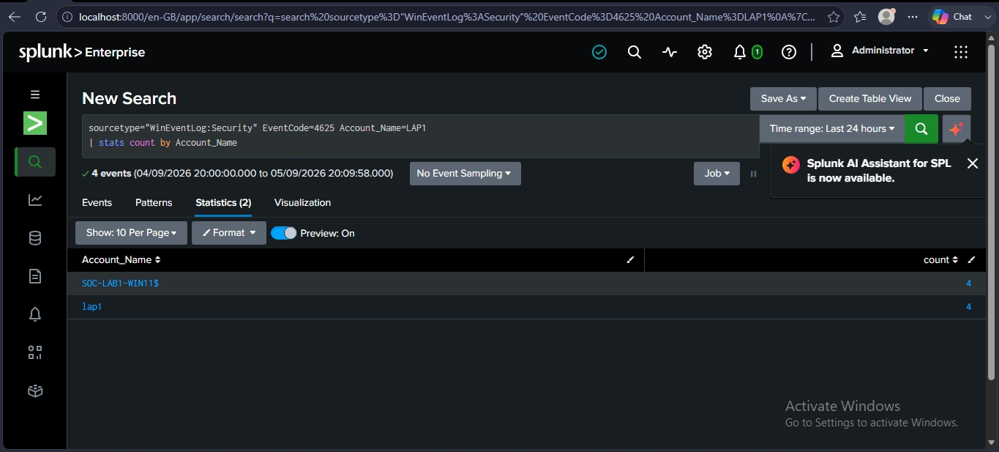
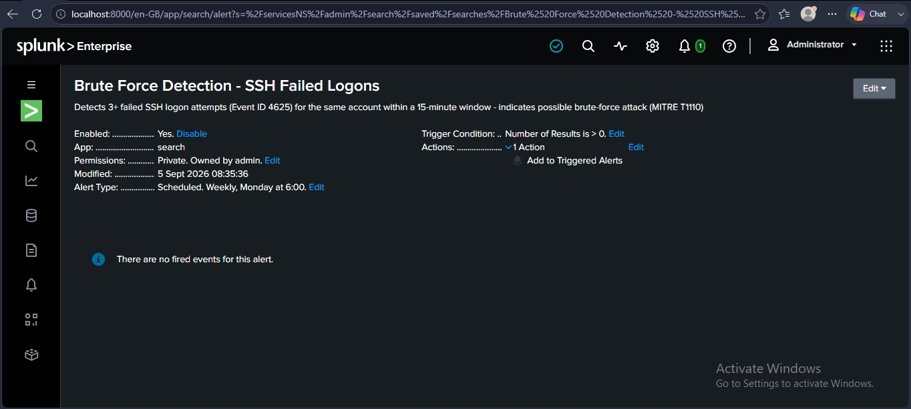
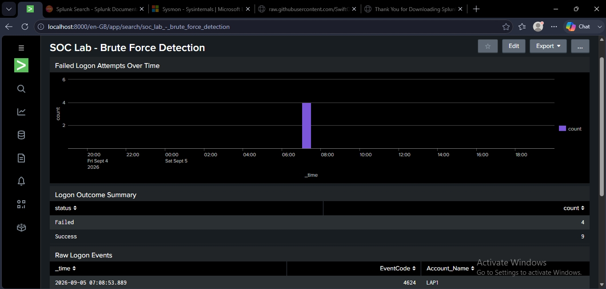

# Splunk SOC Brute-Force Detection Lab

A home SOC lab simulating a brute-force attack (MITRE ATT&CK T1110) and building end-to-end detection using Splunk Enterprise.

## Overview

This project simulates a real-world credential-guessing attack against a Windows target, then builds a complete detection pipeline around it in Splunk — from raw Windows Event Logs to a correlation search, a scheduled alert, and a triage dashboard. It was built as a hands-on portfolio project to demonstrate practical SOC analyst skills.

## Architecture

- **Target:** Windows 11 VM — Sysmon (SwiftOnSecurity config) + Splunk Enterprise + OpenSSH Server
- **Attacker:** Kali Linux VM — THC-Hydra
- **Network:** Isolated VirtualBox host-only network (192.168.56.0/24), with no route to the internet or the host's real network

## What This Demonstrates

- Windows Event Log analysis (Event ID 4625 / 4624)
- Splunk data ingestion via local Windows Event Log inputs
- SPL (Search Processing Language) for correlation-based detection
- Scheduled alerting logic
- Dashboard design for SOC triage
- MITRE ATT&CK technique mapping

## Attack Simulation

THC-Hydra was run from Kali against the Windows target's SSH service, attempting a list of candidate passwords for a known account. Full details: [docs/02-attack-simulation.md](docs/02-attack-simulation.md)

## Detection & Alerting

A Splunk search identifies accounts with 3+ failed logon attempts in a short window and is saved as a scheduled alert. Full details: [docs/03-detection-and-alerting.md](docs/03-detection-and-alerting.md)

## Dashboard

A three-panel Splunk dashboard supports investigation and triage of the detected attack.

## MITRE ATT&CK Mapping

This attack and detection are mapped to **T1110.001 – Password Guessing**. Full mapping: [docs/04-mitre-mapping.md](docs/04-mitre-mapping.md)

## Documentation

- [Lab Setup](docs/01-lab-setup.md)
- [Attack Simulation](docs/02-attack-simulation.md)
- [Detection & Alerting](docs/03-detection-and-alerting.md)
- [MITRE ATT&CK Mapping](docs/04-mitre-mapping.md)

## Tools Used

- VirtualBox 7.x
- Windows 11 (Sysmon + SwiftOnSecurity config)
- Kali Linux 2026.2
- Splunk Enterprise Free
- THC-Hydra

- Finalize README with project overview and screenshots.
